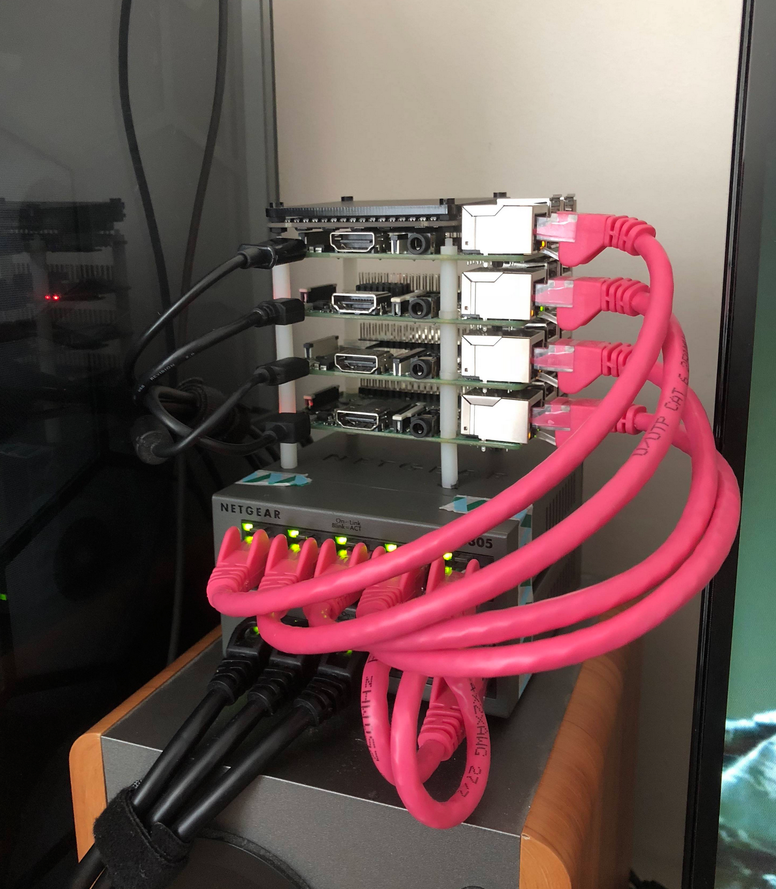

# arussellsaw's raspberry pi kubernetes cluster

initially this repo is going to be tracking my progress and saving utilities, eventually i'd like to turn it into a proper guide and resource center.

#### Setup

for my initial setup i followed the @alexellis tutorial, with a few key changes. i ended up using kubernetes 1.8.3, and the flannel overlay network, this is due to issues with the more recent releases of kubernetes and weave. hopefully when fixes are implemented this will change.

you can find the tutorial gist here https://gist.github.com/alexellis/fdbc90de7691a1b9edb545c17da2d975

and a longer post on his pi cluster here https://blog.alexellis.io/serverless-kubernetes-on-raspberry-pi/

#### Workloads

* nsqd/nsqlookupd/nsqadmin

* openfaas

#### DNS + Virgin Media

if you don't override default DNS servers on virgin media, their awful DNS hijacking will prevent a lot of k8s resources from resolving correctly, so make sure you have a sane DNS config
